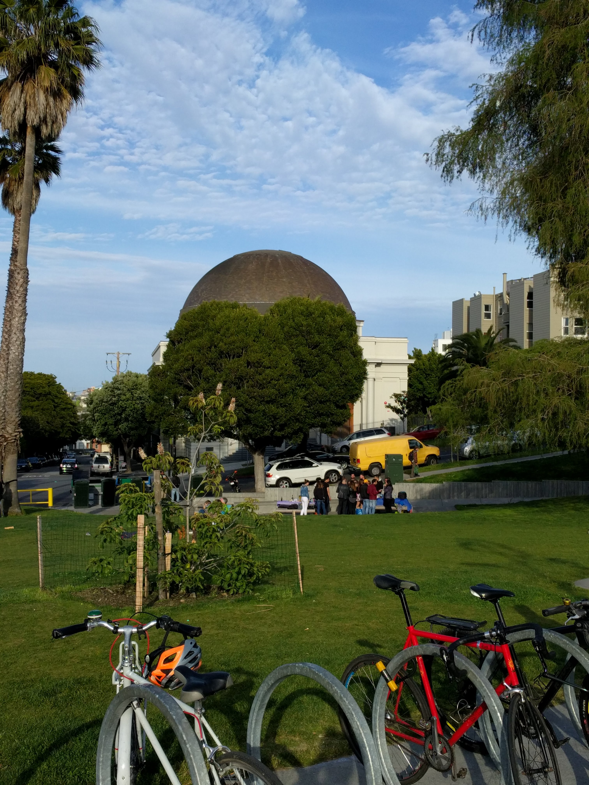

--
layout: default
title: mhoffman.github.com/photos/
---

## Photos

### Something Soothing for the Eyes

*Caption*

*Caption*

*Caption*

*Caption*

*Caption*

*Caption*

*Caption*

*Caption*

*Caption*

*Caption*

*Caption*

*Caption*

*Caption*

*Caption*

*Caption*

*Caption*

*Caption*

*Caption*

*Caption*

*Caption*

*Caption*

*Caption*
