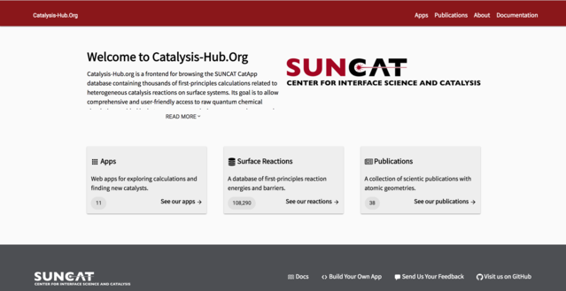
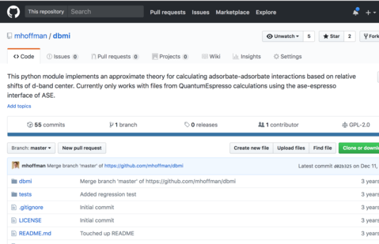

## Scientific

### Catalysis-Hub.Org (Frontend/Architecture)

[Catalysis Hub](http://www.catalysis-hub.org/) is a React frontend for the Catalysis Hub database. More soon under [Catalysis-Hub.org](http://catalysis-hub.org/). Documentation at [ReadTheDocs](http://docs.catalysis-hub.org). Testing at [Travis CI](https://travis-ci.org/).

*[Screenshot of catalysis-hub.org](Catalysis-Hub.Org)*

### kmos

<iframe width="560" height="315" src="https://www.youtube.com/embed/J8-Ion2I3eA" frameborder="0" allowfullscreen></iframe>

[kmos](https://github.com/mhoffman/kmos) is a python framework suitable for fast setup and evaluation of lattice kinetic Monte  Carlo models. It basically allows you develop your model with as little coding a necessary and you can make nice [movies](https://www.youtube.com/watch?v=J8-Ion2I3eA), too. Please check out the [documentation](http://kmos.readthedocs.org/en/latest/) and the [paper](http://arxiv.org/pdf/1401.5278.pdf) ([paywall](http://www.sciencedirect.com/science/article/pii/S001046551400126X)).

### Castep ASE Calculator

*[Readme for ASE Castep calculator](https://wiki.fysik.dtu.dk/ase/ase/calculators/castep.html)*

The [Castep interface](https://gitlab.com/ase/ase/blame/master/ase/calculators/castep.py) is a python module that was initially developed with [Joerg Meyer](https://scholar.google.com/citations?user=zvVgmmEAAAAJ&hl=en),
who wrote most of the parsing, to leverage the awesome
functionalities of the [Atomic Simulation Environment](https://wiki.fysik.dtu.dk/ase/) with the plane-wave pseudo-potential DFT Code [CASTEP](http://castep.org/).
It has been merged into ASE and received maintenance from [different people](https://gitlab.com/ase/ase/blame/master/ase/calculators/castep.py).
Secret sauce: keywords are processed from invoking CASTEP binary so the interface can automatically deal with newly implemented features in CASTEP Code.

### dbmi

The [dbmi](https://github.com/mhoffman/dbmi) module implements the adsorbate-adsorbate interaction framework presented in [J. Phys. Chem. C, 2016, 120 (24), pp 13087–13094](https://dx.doi.org/10.1021/acs.jpcc.6b03375).

*[Repository page of dbmi project.](https://wiki.fysik.dtu.dk/ase/ase/calculators/castep.html)*

## Side Projects

### Made In Democracy

A simple [mobile app](https://expo.io/@mjhoffmann/MadeInDemocracy) [(source)](https://github.com/mhoffman/MadeInDemocracy) that let's you look-up indicators from your phone about the state of democracy, worker's rights, and freedom of press while shopping.

### nmrfmo

[nmrfmo](https://expo.io/@mhoffman/nmrfmo) is a React Native app that summarizes events from over 200 website on a single map.

### wikiexplore

[wikiexplore](http://wikiexplore.herokuapp.com/) is a single-page app that helps exploring one's geographical environment by leveraging the power of OpenStreetMap and Wikipedia. (Give it a second to load initially.)

